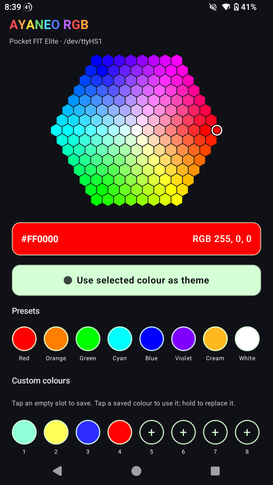
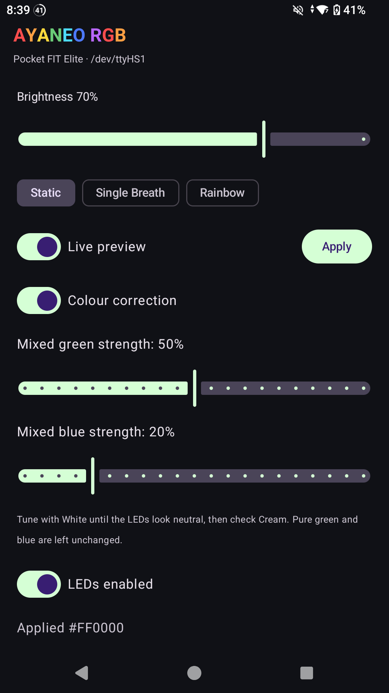

# AYANEO RGB Control

An experimental Android controller for the analogue-stick RGB lighting on the
AYANEO Pocket S2 / S2 Pro, Pocket EVO, and Pocket FIT Elite.

The app provides:

- a honeycomb colour picker that consumes drag gestures without scrolling the page;
- optional corrected colour output with persistent mixed-green and mixed-blue
  calibration controls and optional per-preset overrides;
- built-in and eight persistent custom-colour presets;
- model-aware Static, Single Breath, RGB Breath, Rainbow, and Reactive modes;
- persistent colour, brightness, mode, and LED on/off settings;
- direct UART output for verified hardware modes;
- Pocket-EVO-only independent stick and eight-quadrant Static editors with
  retained colour and brightness per target;
- AYANEO GameWindow integration for animated modes on S2 and EVO;
- exportable diagnostics for identifying and researching unknown devices.

## Pocket FIT Elite screenshots

<p align="center">
  
  
</p>

## Hardware support

The app selects a verified profile from Android's device identity:

| Device | Stock profile | RGB UART | Protocol selector |
| --- | --- | --- | --- |
| Pocket S2 / S2 Pro | AR10 | `/dev/ttyHS5` | `0x08` |
| Pocket EVO | AR07 | `/dev/ttyHS4` | `0x02` |
| Pocket FIT Elite | KR02 | `/dev/ttyHS1` | KR02 11-byte protocol |

Direct S2 Static control uses its selected UART at 115200 baud with a 27-byte
register packet captured from AYANEO GameWindow. Pocket EVO's ordinary stock
effects stay with GameWindow; its explicit advanced transaction uses the validated
AR07 frames only after acquiring `/dev/ttyHS4`. The official v23 controller
payload analysis and bounded Pocket EVO hardware tests establish independent
left/right ring and four-zone RGB control, including per-zone brightness. This
route is Pocket EVO-specific; it does not change the S2, FIT Elite, or unknown
device profiles. Version 0.5.1 keeps the low-level builders behind a dedicated
ownership transaction that pauses GameWindow and offers an explicit stock
handoff afterward.

Pocket FIT Elite uses the separate 11-byte KR02 light command recovered from its
installed GameWindow package for Static, Single Breath, Rainbow, and LED off. For
KR02 control, the app first stops GameWindow's software RGB writer to prevent both
applications from racing on the same UART. Unknown devices enter safe mode:
configuration integration remains available, but direct UART output is disabled
until a verified profile is added.

The **Export diagnostics** button creates one combined report under
`/storage/emulated/0/AYARGB/`, where it can be retrieved through normal USB
file transfer. The report includes the test notes template,
Android hardware identity, selected safety profile, GameWindow version, recent
apply/IPC results, candidate UART metadata, and any UART descriptor currently
owned by GameWindow. The root probe is read-only and never sends a UART packet.
The report intentionally excludes the device serial number. It can identify a
likely UART and protocol family, but actual packet capture still requires a
separate controlled trace.

Unknown-device users and Pocket EVO devices can also export one
GameWindow research ZIP. It contains the diagnostic report and the APK files
from the GameWindow installation for offline protocol analysis. Creating it
does not open or write to a UART.

Unknown devices also receive an in-app **Help add this device** guide. It keeps
direct UART disabled and asks the tester to:

1. select Static in AYANEO's stock RGB controls;
2. select a clear green and then a clear blue;
3. record how the physical LEDs appear;
4. export the combined diagnostic report; and
5. export the GameWindow research ZIP if requested.

The guide explicitly warns users not to experiment with UART nodes manually.

## Pocket EVO per-quadrant RGB

Pocket EVO per-stick and per-quadrant control is now recovered and physically
validated. The active software during validation was GameWindow 1.5.66 (code
186) and AYANEO Settings 1.1.94 (code 129), with the local AR07 controller
version marker containing ASCII `23`. That mutable marker is only a safety gate;
the protocol claims come from the physical tests described below. Static analysis
of AYANEO's official v23 payload exposed the register
proxy which GameWindow's fixed 27-byte frames already reach; bounded tests then
confirmed the selectors, all four physical zones on both rings, independent ring
colours, independent zone colours, and per-zone brightness.

The verified I2C targets are `0x21` for the left ring, `0x20` for the right ring,
and `0x1C` for both rings. With 0 degrees at the top and increasing clockwise,
zone indices map identically on both rings: index 0 is 270 degrees/left, index 1
is 0 degrees/top, index 2 is 90 degrees/right, and index 3 is 180 degrees/bottom.
RGB register banks are `0x46..0x48`, `0x49..0x4B`, `0x4C..0x4E`, and
`0x4F..0x51`; the active AR07 brightness registers are `0x21..0x24`.

GameWindow still owns `/dev/ttyHS4` during normal operation and can race with or
overwrite another writer. Version 0.5.1 therefore pins GameWindow 1.5.66/code
186 and controller marker `23`, verifies the active Magisk module and live UART
SELinux label, and serializes ownership before it exposes Pocket-EVO-only **Per
stick** and **Quadrants** controls. It persists the handoff state, stops
GameWindow, requires two consecutive bounded no-owner checks, applies each
validated frame as three spaced identical writes, and provides **Return RGB
control to AYANEO** to restart and verify the stock service. Live preview is
disabled for these multi-frame modes. No minimum inter-frame delay was inferred
from the physical tests; the app uses a conservative bounded delay.

On 2026-08-28, version 0.5.0/code 16 passed a supervised end-to-end app run on
the validated Pocket EVO. **Per stick** retained left red at 80% brightness and
right blue at 100% simultaneously. **Quadrants** then placed all eight chosen
colours at the documented physical positions on both rings. This validates the
UI indexing, retained snapshots, frame builders, and direct ownership path in
addition to the earlier raw-frame tests.

The repository includes a passive Frida capture agent, an attach-only host
runner, and an offline trace decoder under [`tools`](tools). See:

- [Pocket EVO findings](docs/pocket-evo-per-quadrant-findings.md)
- [Pocket EVO passive capture procedure](docs/pocket-evo-capture.md)

These capture tools observe GameWindow's writes and decode saved traces. They do
not open the UART, replay packets, or scan register values. The later physical
validation used a separate bounded workflow derived from the official AR07
firmware; it did not enter the bootloader, run the Settings updater, or flash any
firmware.

## Why colour correction is needed

The RGB numbers accepted by the controller do not always produce the colour
they normally represent on a screen. On the tested S2 and EVO units, pure red,
green, and blue were recognisable, but mixed colours containing red were
strongly skewed because the green and blue components visually overpowered
red. For example, requested orange could appear green, while cream or white
could appear cyan or teal.

This is a device-output calibration problem, not an error in the hex picker.
The exact cause has not been proven; possible contributors include unequal LED
channel brightness, diffuser/optical mixing, and calibration or colour-space
handling in the controller firmware.

The optional **Colour correction** switch applies the empirically tested
workaround when red is present:

- red is left unchanged;
- green is reduced to 20% of the requested value;
- blue is reduced to 20% of the requested value;
- pure green and pure blue are left unchanged.

This correction is deliberately simple, not a calibrated colour-management
profile. Results may vary between devices and LED batches, highly saturated
mixed colours may still differ from their on-screen preview, and animated
stock effects may perform additional processing. The switch can be disabled
to send the uncorrected RGB values.

## Requirements

- AYANEO Pocket S2 / S2 Pro, Pocket EVO, or Pocket FIT Elite
- rooted Android installation with Magisk
- AYANEO GameWindow installed for animated modes
- Android SDK and JDK 21 to build

Root is required because Android does not normally allow third-party apps to
write the AYANEO configuration files or controller UART.

## Build

Set `sdk.dir` in a local, untracked `local.properties`, then run:

```sh
./gradlew :app:assembleDebug
```

The debug APK is generated at:

```text
app/build/outputs/apk/debug/app-debug.apk
```

## UART access module

The source for the device-aware Magisk module is in
[`magisk-module`](magisk-module). Package it from the project directory:

```sh
zip -j ayaneo-rgb-uart-magisk.zip \
  magisk-module/module.prop \
  magisk-module/service.sh \
  magisk-module/sepolicy.rule \
  magisk-module/customize.sh
```

Install the ZIP through Magisk and reboot. The module detects the model before
changing anything:

- Pocket S2 / S2 Pro: waits for `/dev/ttyHS5`;
- Pocket EVO: waits for `/dev/ttyHS4`;
- Pocket FIT Elite: waits for `/dev/ttyHS1`;
- unknown devices: exits without touching any UART;
- labels that node `ayaneo_rgb_device`;
- restores ownership to `system:system` and mode `664`;
- adds SELinux access rules for AYANEO's `system_app` and Magisk's root domain.

## Current mode routing

| Mode | S2 / S2 Pro | EVO | FIT Elite | Backend |
| --- | --- | --- | --- | --- |
| Static | Yes | Yes | Yes | S2: direct AR10; EVO: GameWindow; FIT Elite: direct KR02 |
| Single Breath | Yes | Yes | Yes | GameWindow on S2/EVO; direct KR02 mode on FIT Elite |
| RGB Breath | No | Yes | No | AYANEO GameWindow service |
| Rainbow | Yes | Yes | Yes | GameWindow on S2/EVO; direct KR02 mode on FIT Elite |
| Reactive | No | Yes | No | AYANEO GameWindow service |
| Per-stick / per-zone Static | No | Yes | No | Validated EVO direct transaction with explicit Apply and stock handoff |

A true spatial rainbow that spins around each LED ring has not yet been
implemented.

## Future development

The current experimental build retains root and direct UART access because the
Android devices are still being used to verify controller packets, model
differences, and lighting behaviour. Removing that path now would make further
hardware investigation more difficult.

The planned normal Android backend is rootless:

1. request Android's **All files access** permission once;
2. write AYANEO's `.aya` configuration through shared storage;
3. ask GameWindow to apply the settings through its existing service;
4. keep direct UART access behind an optional research/developer setting;
5. remove the Magisk requirement from normal releases after the rootless path
   has passed the same mode, persistence, restart, and LED-off tests on every
   supported device.

Until then, the verified rooted implementation remains the stable test path.
Future device profiles will continue to default to safe mode: no direct UART
write is allowed until the device node and protocol selector have been
captured and tested on real hardware.

## Safety

This is device-specific experimental software. The UART implementation sends
lighting commands only; it does not flash controller firmware. Even so, review
the Magisk module and source before installing, and keep a working recovery
path for rooted-device changes.
